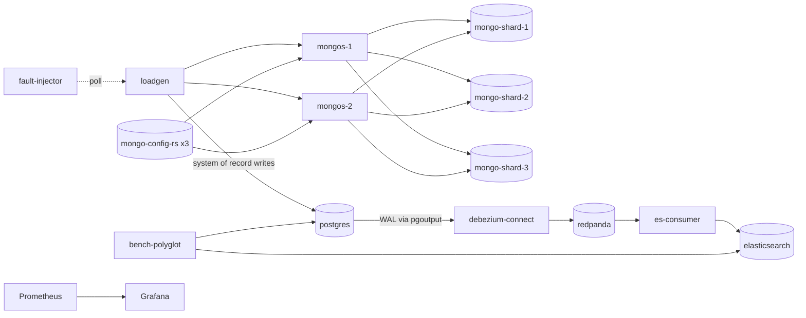

# Lab 4-3 — NoSQL, Sharding, Polyglot Persistence, and CDC

A complete, runnable lab for the topic-249 step-by-step guide. Stand up
Postgres + a sharded MongoDB cluster + Debezium + Elasticsearch on
`docker compose`, drive it with the bench scripts, and produce the
artifacts the architecture review cites.

## Quick start

```bash
cp .env.example .env             # tweak host ports if any clash
make up                          # ~13 containers, ~30s to healthy
make seed                        # bootstraps mongo shards + Debezium + ES indices
make env-fingerprint             # captures perf/results/env.txt
```

## Step-by-step (matches topic-guide-249)

| Step | Make targets                                                                                  |
|------|-----------------------------------------------------------------------------------------------|
| 1    | `make up`, `make ps`, `make seed`, `make debezium-status`                                     |
| 2    | `make env-fingerprint`                                                                        |
| 3    | `make bench-skew SHARD_KEY=candidate RUNS=3 DURATION=5m && make analyze-skew LABEL=candidate` |
| 4    | `make inject-hot ENTITY=tenant-A WEIGHT=0.35 && make bench-skew RUNS=3 LABEL=hot-injected && make analyze-skew LABEL=hot-injected && make clear-hot` |
| 5    | `make apply-fix CANDIDATE=composite-key && make inject-hot && make bench-skew SHARD_KEY=fixed LABEL=shard-key-after RUNS=3 && make compare-skew BEFORE=hot-injected AFTER=shard-key-after && make clear-hot` |
| 6    | `make bench-cdc-lag RUNS=3 LABEL=base && make bench-cdc-lag RUNS=3 RATE=2x LABEL=2x && make analyze-cdc-lag` |
| 7    | `make bench-polyglot RUNS=3 FRESHNESS=lsn-wait`                                               |
| 8    | edit `docs/review.md` (template in `docs/review.template.md`)                                 |
| 9    | `make check-submission && make down`                                                          |

## Stack



## Tree

```
labs/4-3-nosql-sharding-polyglot-persistence-cdc/
  Makefile                           every step a target
  docker-compose.yml                 ~13 containers
  Dockerfile                         shared, BIN build arg
  go.mod / go.sum
  cmd/                               loadgen, bench-skew, bench-cdc-lag, bench-polyglot,
                                     es-consumer, fault-injector, partition-stats
  internal/                          shardkey, cdc, freshness, mongoutil,
                                     metrics, payloads, fault, svchelp
  postgres/                          postgresql.conf (wal_level=logical), init.sql
  mongo/                             config-init.js, shards-init.js, bootstrap.sh
  debezium/                          connector-postgres.json, register.sh
  elasticsearch/mappings/            products.json, orders.json, users.json
  prometheus/                        prometheus.yml, rules/polyglot.yml
  grafana/                           datasource + dashboard JSON
  perf/                              env.sh, workload.json, results/
  scripts/                           seed, debezium-status, run-bench-*, analyze, compare,
                                     inject-hot, clear-hot, apply-fix, check-submission
  docs/                              review.template.md, architecture.md, freshness-policy.template.md
  runbooks/                          hot-partition-incident.md, cdc-stuck-incident.md
```

## Service ports (override via `.env`)

| Service              | Default host port                    |
|----------------------|--------------------------------------|
| Postgres             | `${LAB_POSTGRES_PORT:-15433}`        |
| Mongo config 1/2/3   | 17017 / 17018 / 17019                |
| Mongo shard 1/2/3    | 17021 / 17022 / 17023                |
| mongos 1/2           | 17040 / 17041                        |
| Redpanda kafka/admin | 19093 / 19645                        |
| Debezium Connect     | `${LAB_DEBEZIUM_PORT:-18083}`        |
| Elasticsearch        | `${LAB_ELASTICSEARCH_PORT:-19200}`   |
| loadgen / es-consumer / partition-stats / fault-injector | 18090 / 18091 / 18092 / 19001 |
| Prometheus / Grafana | `${LAB_PROMETHEUS_PORT:-19091}` / `${LAB_GRAFANA_PORT:-13001}` |

See `docs/architecture.md` for the per-component details and
`docs/freshness-policy.template.md` for how to document the read-path
trade-offs in your submission.
